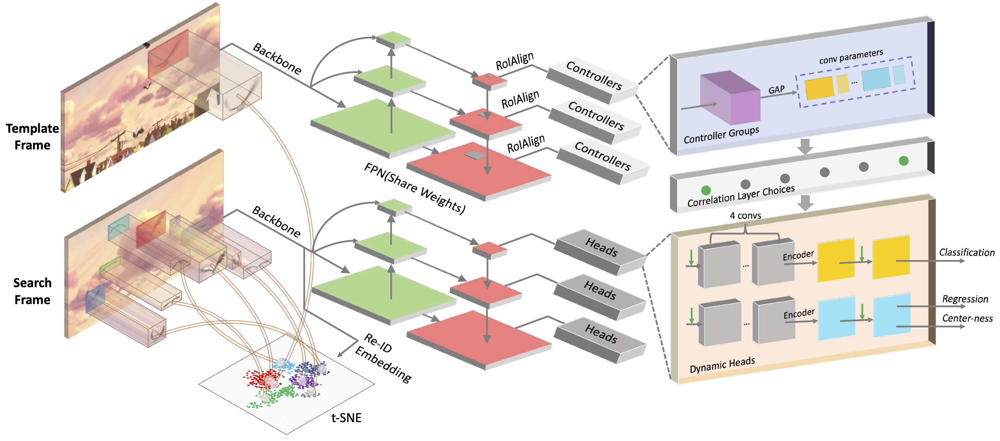

# DMTrack

Official implementation of our CVPR2021 paper: Distractor-Aware Fast Tracking via Dynamic Convolutions and MOT Philosophy.



Paper on arXiv: [2104.12041](https://arxiv.org/abs/2104.12041).

## Installation

To reproduce our Python environment, please follow command lines below (we use `CUDA toolkit 10.0` `CUDNN 7.6`):

** notice: Please use the specific versions of mmdetection and mmcv module included in this repo. **

```shell
git clone https://github.com/hqucv/dmtrack

cd dmtrack

conda env create -f env.yml

conda activate dmtrack

pip install scikit-build

pip install cmake

cd _submodules/mmcv

python setup.py develop

pip install pillow==6.2.0 -i https://pypi.tuna.tsinghua.edu.cn/simple

cd ../mmdetection

python setup.py develop

# installing dependencies for mmdetection
pip install -r requirements.txt

pip install pycocotools

```

## Run Training

(Assuming all datasets are stored in `~/data`) 

```
# training for DMTrack-GlobalSearch (with 2 Tian Xp 12G)
CUDA_VISIBLE_DEVICES=0,1 python tools/train_dmtrack.py --config configs/dmtrackGS_dla34_fpn.py --gpus 2
```

## Run Tracking

(Assuming all datasets are stored in `~/data`).

```shell
python tools/test_dmtrack.py
```

## Metric

#### LaSOT Testset

Name | Inf. Time | Success | Precision | Download
--- |:---:|:---:|:---:|:---:
[DMtrack-GlobalSearch](configs/dmtrackGS_dla34_fpn.py) | 32 FPS | 53.0 | 54.2 | Google Drive: [link](https://drive.google.com/file/d/1_MHc1N6vdUcq-NZ-j4h4RagzoxHpsh7D/view?usp=sharing) Baidu Yun: [link](https://pan.baidu.com/s/11XQ-mSv1MgbjX1vGjTJpAQ)  password: 81fh
DMTrack-ReID | 31 FPS | 57.4 | 58.0 | 

## TODO

- Releasing config and weight for an improved GlobalTrack
- Clear up code for MOT training
- Releasing model for DMTrack-ReID
- More comparisons

## Issues

Please report issues in this repo if you have any problems.

## Cite

```
@inproceedings{dmtrack,
  title={Distractor-Aware Fast Tracking via Dynamic Convolutions and MOT Philosophy},
  author={Zhang, Zikai and Zhong, Bineng and Zhang, Shengping and Tang, Zhenjun and Liu, Xin and Zhang, Zhaoxiang},
  booktitle={Proceedings of the IEEE/CVF Conference on Computer Vision and Pattern Recognition},
  pages={1024--1033},
  year={2021}
}
```

## Reference

Thanks for these great works!
- [GlobalTrack](https://github.com/huanglianghua/GlobalTrack)
- [FairMOT](https://github.com/ifzhang/FairMOT)
- [CondInst](https://github.com/aim-uofa/AdelaiDet/blob/master/configs/CondInst/README.md)